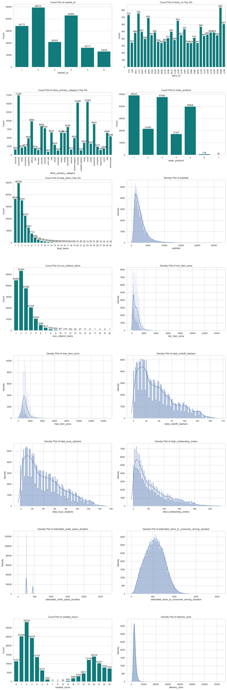
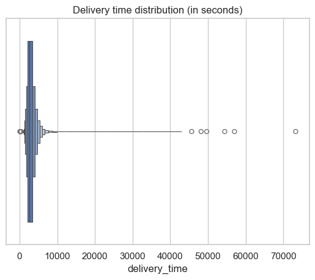
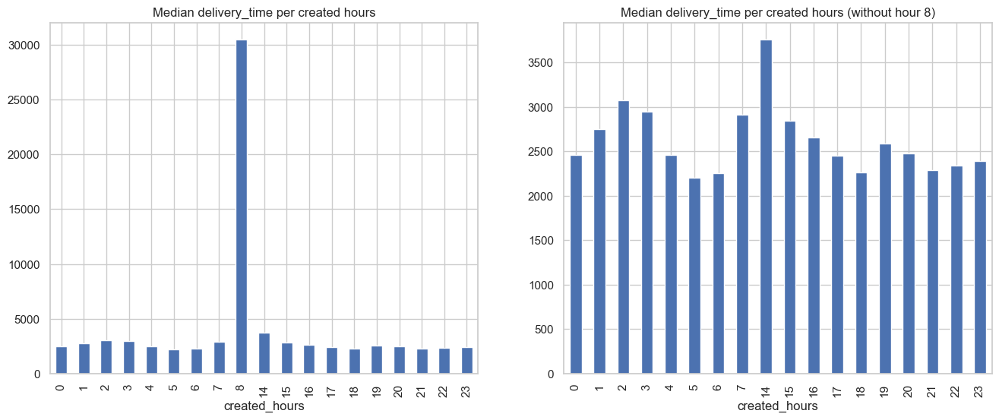
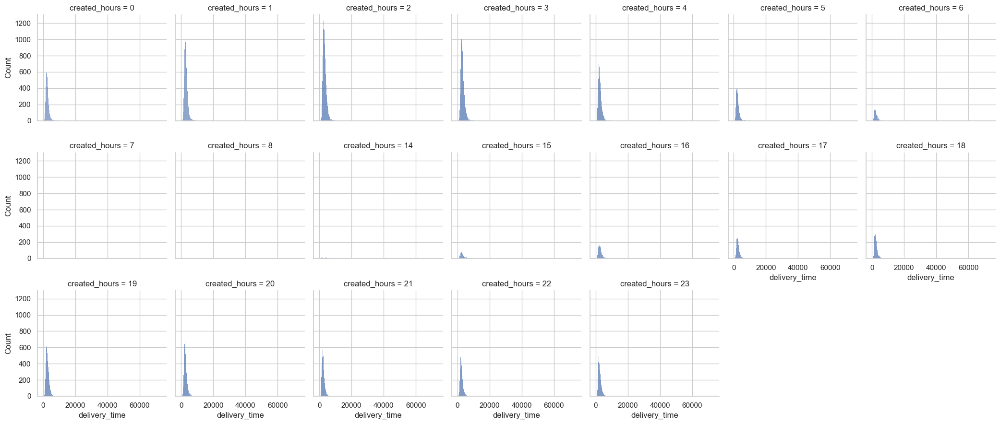
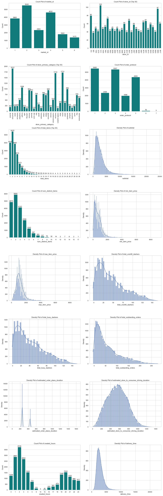
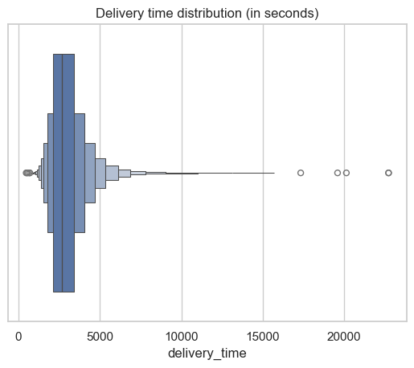
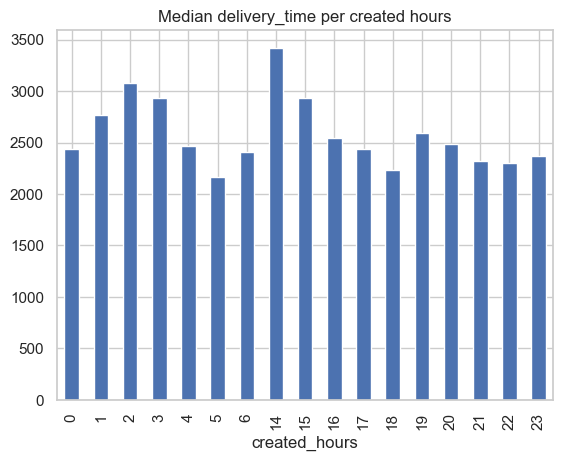
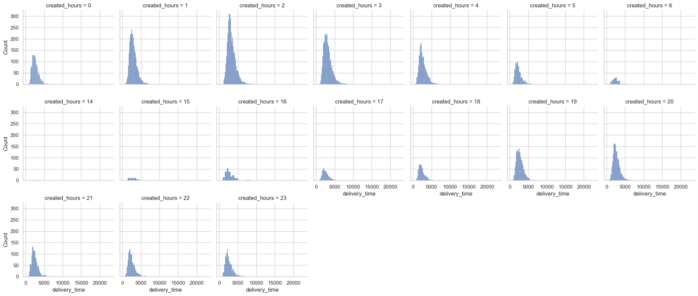

The analysis is from the notebook `doordash-analysis.ipynb`.

# Data Description
## 1. Time features
- `market_id`: A city/region in which DoorDash operates, e.g., Los Angeles, given in the data as an id
- `created_at`: Timestamp in UTC when the order was submitted by the consumer to DoorDash. (Note this timestamp is in UTC, but in case you need it, the actual timezone of the region was US/Pacific)
- `actual_delivery_time`: Timestamp in UTC when the order was delivered to the consumer

## 2. Store features
- `store_id`: an id representing the restaurant the order was submitted for
- `store_primary_category`: cuisine category of the restaurant, e.g., italian, asian
- `order_protocol`: a store can receive orders from DoorDash through many modes. This field represents an id denoting the protocol

## 3. Order features
- `total_items`: total number of items in the order
- `subtotal`: total value of the order submitted (in cents)
- `num_distinct_items`: number of distinct items included in the order
- `min_item_price`: price of the item with the least cost in the order (in cents)
- `max_item_price`: price of the item with the highest cost in the order (in cents)

## 4. Market features
- `total_onshift_dashers`: Number of available dashers who are within 10 miles of the store at the time of order creation
- `total_busy_dashers`: Subset of above total_onshift_dashers who are currently working on an order
- `total_outstanding_orders`: Number of orders within 10 miles of this order that are currently being processed.

## 5. Predictions from other models
- `estimated_order_place_duration`: Estimated time for the restaurant to receive the order from DoorDash (in seconds)
- `estimated_store_to_consumer_driving_duration`: Estimated travel time between store and consumer (in seconds)

# Explanatory Data Analysis
There were a total of 197428 entries, where they contains some missing values.
```
RangeIndex: 197428 entries, 0 to 197427
Data columns (total 16 columns):
 #   Column                                        Non-Null Count   Dtype  
---  ------                                        --------------   -----  
 0   market_id                                     196441 non-null  float64
 1   created_at                                    197428 non-null  object 
 2   actual_delivery_time                          197421 non-null  object 
 3   store_id                                      197428 non-null  int64  
 4   store_primary_category                        192668 non-null  object 
 5   order_protocol                                196433 non-null  float64
 6   total_items                                   197428 non-null  int64  
 7   subtotal                                      197428 non-null  int64  
 8   num_distinct_items                            197428 non-null  int64  
 9   min_item_price                                197428 non-null  int64  
 10  max_item_price                                197428 non-null  int64  
 11  total_onshift_dashers                         181166 non-null  float64
 12  total_busy_dashers                            181166 non-null  float64
 13  total_outstanding_orders                      181166 non-null  float64
 14  estimated_order_place_duration                197428 non-null  int64  
 15  estimated_store_to_consumer_driving_duration  196902 non-null  float64
```

A new feature `created_hours` were created to replace the `created_at` feature to just extract the hour in the day, while the target value `delivery_time` was extracted from the time difference between `created_at` and `actual_delivery_time`.

# Distributions

The distributions between train set and test set are basically the same, except test set does not contain orders created at 8 am, but there were just 2 entries in the train set as well so it should not affect the outcome much.

## Train set

### Features distribution


### Target distribution


### Delivery time grouped by `created_hours`


### Delivery time distribution grouped by `created_hours`


## Test set

### Features distribution


### Target distribution


### Delivery time grouped by `created_hours`


### Delivery time distribution grouped by `created_hours`


